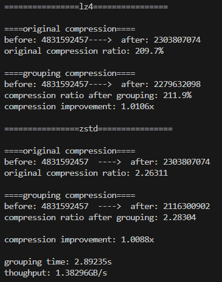

### Introduction
This project implements a chunk grouping/clustering algorithm to enhance the compression ratio for general lossless compression.

(C) 2025 by Institute of Computing Technology, Chinese Academy of Sciences.

* Developers: Junyu Long, Liyang Zhao
* Advisors: Dingwen Tao, Guangming Tan

### Install Dependences
Ensure the following libraries are installed before building:
- Compression Libraries: LZ4, Zstandard (ZSTD)
LZ4: https://github.com/lz4/lz4. git clone and make
Zstandard: https://github.com/facebook/zstd. git clone and make

- Logging & Flags: glog (version <= 0.6.0), gflags

**glog**
```
wget https://github.com/google/glog/archive/refs/tags/v0.6.0.tar.gz
tar -xvzf v0.6.0.tar.gz
cd glog-0.6.0
mkdir build && cd build
cmake .. && make
make install
```

**gflags**
```
wget https://github.com/gflags/gflags/archive/refs/tags/v2.2.2.tar.gz
tar -xvzf v2.2.2.tar.gz
cd gflags
mkdir build && cd build
make && make install
```

- Testing Framework: gtest

**gtest**
```
wget https://github.com/google/googletest/archive/refs/tags/v1.16.0.tar.gz
cd googletest
mkdir build && cd build
make && make install
```

- Mathematical Libraries: GSL

**GSL**
```
wget https://mirror.ibcp.fr/pub/gnu/gsl/gsl-latest.tar.gz
tar -xvzf gsl-latest.tar.gz
cd gsl-2.8
./configure
make && make install
```

### Test Files
Test data should be placed in
```
/cluster_compress/test_data/test/
```

### Build the Project
Run the following commands to clone, build, and compile the project:

```
git clone git@github.com:hpdps-group/chunk-grouping.git
cd cluster_compress
mkdir build && cd build
cmake .. && make -j
cd ..
```

### Running the Program
Use the following command to execute the chunk grouping algorithm:
```
./build/cluster_compression --config="config.toml"
```

### Example Output

