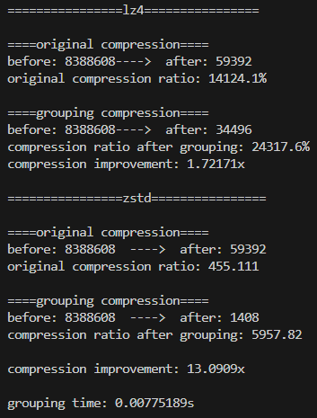

### Introduction
This project is an implementation of clustering compression algorithm.
* Developers:
* Advisors:

### Dependences
lz4 zstd glog-under0.6.0 gflags gtest OpenBLAS gsl

### Test Files
test data dir: `/cluster_compress/test_data/test/`.

put your test data in this dir.

### Build
To build the library, run the following commands：
```
git clone git@github.com:xiaodou1117/cluster_compress.git
cd cluster_compress
mkdir build
cd build
cmake ..
make -j
cd ..
```

### Run
```
./build/cluster_compression --config="config.toml"
```

### Example Output


### Reference
@inproceedings{10.1145/3620665.3640353,
author = {Huang, Hongming and Wang, Peng and Su, Qiang and Xu, Hong and Xue, Chun Jason and Brinkmann, Andr\'{e}},
title = {Palantir: Hierarchical Similarity Detection for Post-Deduplication Delta Compression},
year = {2024},
isbn = {9798400703850},
publisher = {Association for Computing Machinery},
address = {New York, NY, USA},
url = {https://doi.org/10.1145/3620665.3640353},
doi = {10.1145/3620665.3640353},
booktitle = {Proceedings of the 29th ACM International Conference on Architectural Support for Programming Languages and Operating Systems, Volume 2},
pages = {830–845},
numpages = {16},
series = {ASPLOS '24}
}